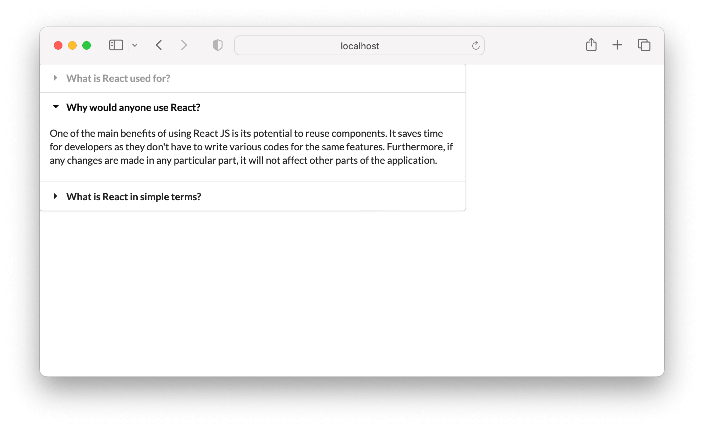

## Conditional Rendering

In Visual Studio code, press `command+shift+v` (Mac) or `ctrl+shift+v` (Windows) to open a Markdown preview.

## Getting Started

Using your command line, you will need to navigate to the this folder, install all dependencies, and start the app.

```bash
cd exercises/04-conditional-rendering/
code . # if you would like to open this in a separate VSCode window
npm install
npm run dev
```

To stop the application, press `ctrl+c`.

To run the tests:

```shell
npm run test
```

If you do not see any test results, press `a` to run all tests. The tests will rerun whenever you make a change.

To stop the tests, press `ctrl+c`.

## Instructions

For this assignment, you will build an accordion. An [accordion](https://semantic-ui.com/modules/accordion.html) is a vertically stacked set of interactive headings that each contain a title, content snippet, or thumbnail representing a section of content. Each section of content can be "expanded" or "collapsed" to reveal the content associated with that item.

### Step 1: Create AccordionSection Component

<ol>
  <li>Create a component named <code>AccordionSection</code>.</li>
  <li>It should render one of the sample HTML snippets below.</li>
  <li>It should receive <code>isOpen</code> (a boolean), <code>title</code>, and <code>content</code> as props.</li>
  <li>If <code>isOpen</code> is true, render the expanded snippet. If false, render the collapsed snippet.</li>
</ol>

### Step 2: Use AccordionSection in App.jsx

<ol>
  <li>Import <code>AccordionSection</code> in your <code>App.jsx</code> file.</li>
  <li>Create an accordion with three sections using <code>AccordionSection</code>.</li>
  <li>Only the middle section should be expanded.</li>
  <li>Loop through the contents of the file <code>src/content/accordion.js</code> to generate the sections.</li>
</ol>

### Step 3: Add CSS

Create a file named App.css and include styles for the accordion. Use the CSS properties<code> display: block </code> and <code>display: none </code> to show or hide the content based on whether the section is expanded or collapsed.



### Acceptance Criteria

<ol>
  <li>An accordion with three sections.</li>
  <li>The middle (second) section should be expanded; the rest should be collapsed.</li>
  <li>Use conditional rendering to solve this problem.</li>
  <li>Loop through the contents of the file <code>src/content/accordion.js</code> to generate the sections.</li>
</ol>

## Sample HTML

This is sample HTML if a section is expanded. (You will need to convert this to JSX.)

```html
<div class="title active">
  <i class="dropdown icon"></i>
  Why would anyone use React?
</div>
<div class="content active">
  <p class="transition visible">
    One of the main benefits of using React JS is its potential to reuse
    components. It saves time for developers as they don't have to write various
    codes for the same features. Furthermore, if any changes are made in any
    particular part, it will not affect other parts of the application.
  </p>
</div>
```

Here is sample HTML for a section that is collapsed. (You will need to convert this to JSX.)

```html
<div class="title">
  <i class="dropdown icon"></i>
  What is React in simple terms?
</div>
<div class="content">
  <p class="transition hidden">
    The Best Guide to Know What Is React [Updated] React is a JavaScript-based
    UI development library. Facebook and an open-source developer community run
    it. Although React is a library rather than a language, it is widely used in
    web development. The library first appeared in May 2013 and is now one of
    the most commonly used frontend libraries for web development.
  </p>
</div>
```
