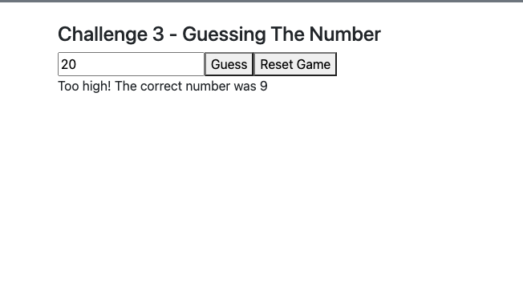

# State Challenge

In Visual Studio code, press `command+shift+v` (Mac) or `ctrl+shift+v` (Windows) to open a Markdown preview.

## Reason for the Challenges

Managing state is often a source of headache for many developers. In these next few challenges will help you improve your ability to manage your app's state.

## Getting Started

Using your command line, you will need to navigate to the this folder, install all dependencies, and start the app.

```bash
cd exercises/06-state/
code . # if you would like to open this in a separate VSCode window
npm install
npm run dev
```

To stop the application, press `ctrl+c`.

To run the tests:

```shell
npm run test
```

If you do not see any test results, press `a` to run all tests. The tests will rerun whenever you make a change.

To stop the tests, press `ctrl+c`.

## Challenge 1

As a user, I would like to see the number of keystrokes a user types displayed on the screen.

### Instructions:

1. Create a component named "CharacterCount". (It will not require any props.)
2. Import and display your "CharacterCount" component inside of _exercises/05-state/src/App.jsx_.
3. It will render a `<textarea>` textbox that will capture user input.
4. It will then render count of the number of characters in the textbox on the screen.

### Acceptance Criteria

You must display the character count to the screen.

You must use the `useState()` hook to solve this problem.


## Challenge 2

As a user, I would like to play a simple number guessing game.

### Instructions:

1. Create a component named "GuessTheNumber". Import and display your "GuessTheNumber" component inside of exercises/05-state/src/App.jsx.
2. It will render an input field for the user to enter a guess, which should be a number between 1 and 10.
3. The input field must validate the entered value. If the user enters an empty input, a 0, or a number outside the range of 1-10, an error message should be displayed prompting them to enter a valid number.|
4. The "GuessTheNumber" component should pick a number between 1 and 10 at random.
5. It will also render a "Submit Guess" button, which, when clicked, will evaluate the user's guess and display a message. The game randomly selects a number between 1 and 10 at the start. If the user's guess is too low, a message saying "Too low! The correct number was [number]" will appear. If the user's guess is too high, a message saying "Too high! The correct number was [number]" will appear. If the user's guess is correct, a message saying "Correct! You win!" will appear.

### Acceptance Criteria

The user is able to input a number between 1 and 10 and submit their guess.

The input field validates the user's input and ensures it's a number between 1 and 10. If the input is invalid (empty, 0, or outside the range of 1-10), an error message is displayed.

If the guess is too low or too high, the correct number is revealed in the feedback message.

If the guess is correct, a message indicating the user's victory is displayed.

You must use the `useState()` hook to solve this problem.


