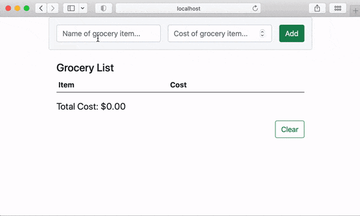

# Create Read Update Delete (CRUD) and Validation Challenge

In Visual Studio code, press `command+shift+v` (Mac) or `ctrl+shift+v` (Windows) to open a Markdown preview.

## Reason for the Challengeimport { useState, useContext, createContext } from "react";
import "./App.css";
import translations from "./assets/translations.json";

/**
 * Initializes the Context API. Think of this as a storage bin or cabinet
 * that stores state that is shared between components.
 */
const TranslatorContext = createContext();

function App() {
  /**
   * State should be set in the parent or a higher level component.
   */
  const [language, setLanguage] = useState("en");
  /**
   * We are wrapping the child component <CreateAccount /> in the <TranslatorContext.Provider /> and storing "language" and "setLanguage" inside of the "TranslatorContext".
   * You must use `value={"what you are storing"}`.
   *
   * This is a similar idea to lifting state up, where you would have a parent pass state ("language") and the update function ("setLanguage") as props. Here is the equivalent with lifting up state:
   * e.g. <CreateAccount language={language} setLanguage={setLanguage} />
   */
  return (
    <TranslatorContext.Provider value={[language, setLanguage]}>
      <CreateAccount />
    </TranslatorContext.Provider>
  );
}

function CreateAccount() {
  /**
   * useContext("TranslatorContext") returns whatever we stored inside of "TranslatorContext".
   * In this case, we stored [language, setLanguage] with the line
   * `<TranslatorContext.Provider value={[language, setLanguage]}>`
   */
  const [language, setLanguage] = useContext(TranslatorContext);
  const t = translations[language];
  return (
    <div className="container pt-4 pb-4">
      <div className="d-flex justify-content-between">
        <div>
          <h1 className="h3">{t["Create a New Account"]}</h1>
          <p className="lead">{t["It’s quick and easy."]}</p>
        </div>
        <div>
          <button
            type="button"
            className="btn btn-link btn-sm"
            onClick={() => setLanguage("en")}
          >
            English
          </button>
          |
          <button
            type="button"
            className="btn btn-link btn-sm"
            onClick={() => setLanguage("es")}
          >
            Español
          </button>
        </div>
      </div>
      <form>
        <div className="row g-3">
          <div className="col-sm-6">
            <label htmlFor="firstName">{t["First Name"]}</label>
            <input
              type="text"
              className="form-control"
              id="firstName"
              name="firstName"
            />
          </div>
          <div className="col-sm-6">
            <label htmlFor="lastName">{t["Last Name"]}</label>
            <input
              type="text"
              className="form-control"
              id="lastName"
              name="lastName"
            />
          </div>
        </div>
        <div className="row gx-3 mt-3">
          <div className="col-sm-6">
            <label htmlFor="email">{t["Email"]}</label>
            <input
              type="email"
              className="form-control"
              id="email"
              name="email"
            />
          </div>
        </div>
        <div className="row gx-3 mt-3">
          <div className="col-sm-6">
            <label htmlFor="password">{t["Password"]}</label>
            <input
              type="password"
              className="form-control"
              id="password"
              name="password"
            />
          </div>
        </div>
        <p className="mt-3">
          <small>
            {
              t[
                "By clicking Sign Up, you agree to our Terms, Data Policy and Cookies Policy. You may receive SMS Notifications from us and can opt out any time."
              ]
            }
          </small>
        </p>
        <button type="submit" className="btn btn-lg btn-success">
          {t["Sign Up"]}
        </button>
      </form>
    </div>
  );
}

export default App;


Managing state is often a source of heartache for many developers. In these next few challenges will help you improve your ability to manage your app's state.

## Getting Started

Using your command line, you will need to navigate to the this folder, install all dependencies, and start the app.

```bash
cd exercises/08-crud/
code . # if you would like to open this in a separate VSCode window
npm install
npm run dev
```

To stop the application, press `ctrl+c`.

To run the tests:

```shell
npm run test
```

If you do not see any test results, press `a` to run all tests. The tests will rerun whenever you make a change.

To stop the tests, press `ctrl+c`.

## User Story

As a user, I would like to have an app that allows me to record my food purchases. The app should allow me to add grocery items to a list, update grocery items, and remove items from the list.

## Acceptance criteria:

1. I should be able to add a grocery item with the cost of the item to my grocery list.
2. I should be able to see the total cost of my groceries.
3. I should be able to delete a single item from my grocery.
4. There should be validation. Both the name of the grocery item and the cost is required and the app should display some kind of feedback when these are not filled out.
5. I should be able to clear everything from the list by pressing a button.


