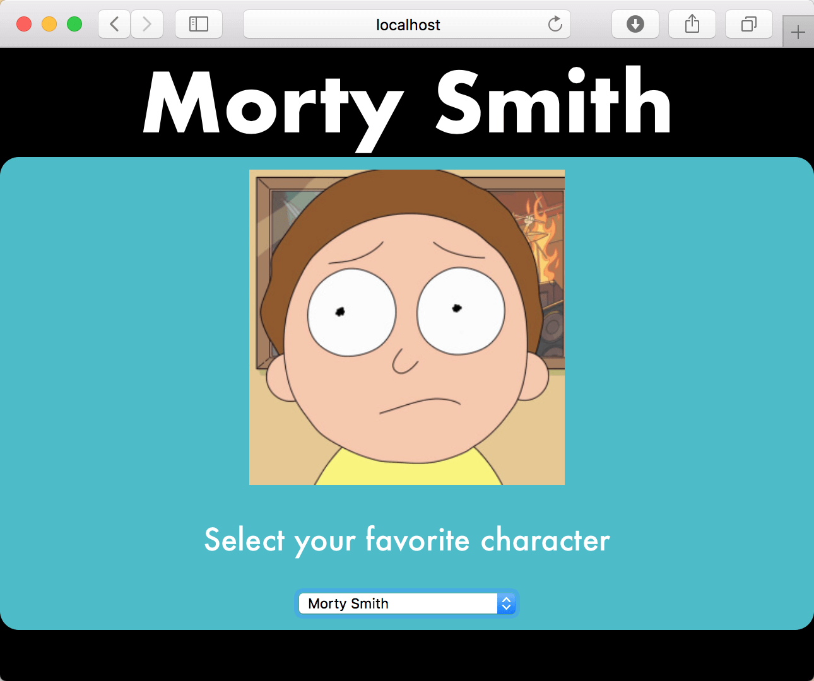

# Effects Challenge 3 - Making Multiple AJAX Requests

In Visual Studio code, press `command+shift+v` (Mac) or `ctrl+shift+v` (Windows) to open a Markdown preview.

## Reason for the Challenge

As Front-End Engineers, we often have to work with APIs, so that we can communicate with a back-end. For example, we can use APIs to store content, modify content, display content on the screen and integrate with third-party services. Understanding the useEffect hook will enable you to make AJAX requests to different APIs.

## Getting Started

Using your command line, you will need to navigate to the this folder, install all dependencies, and start the app.

```bash
cd exercises/14-use-effect/
code . # if you would like to open this in a separate VSCode window
npm install
npm run dev
```

**NOTE that when you start this application, you will see the compilation errors. You will fix this.**

## User Stories

As a user, I want to select a Rick and Morty from a list of characters so that I can see the character's name and what he or she looks like.




## Acceptance Criteria

- The application should make AJAX requests to the [Rick and Morty API](https://rickandmortyapi.com/).
- The application should use the useEffect hook at least once.
- Immediately after the component first renders, it should get a list of characters and display the character names as choices in a dropdown.
- When the user selects a character from the dropdown, the application should look up more information on the character. When the AJAX request finishes, the character's name and image should appear on the screen.

## Instructions

Before doing this exercise, read the documentation for [getting all Rick and Morty characters](https://rickandmortyapi.com/documentation/#get-all-characters) and [looking up a single Rock and Morty character](https://rickandmortyapi.com/documentation/#get-a-single-character).

If you would like to use the Axios library, install it with `npm install axios`. (Vite.js doesn't come with the Axios library, so you will need to install it separately.) Alternatively, you can use the browser native Fetch API.

Complete the instructions in [App.jsx](src/App.jsx).
