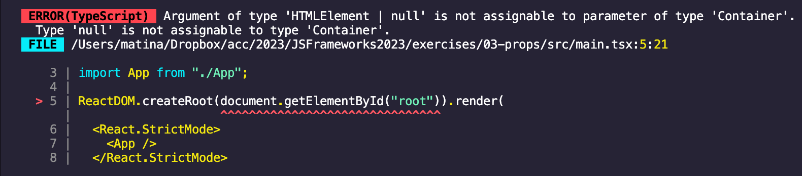

# TypeScript

In Visual Studio code, press `command+shift+v` (Mac) or `ctrl+shift+v` (Windows) to open a Markdown preview.

## Reasons for Challenge

TypeScript is a very marketable skill for those of you who are job searching. It is a very useful tool that stops you from introducing type related bugs from application.

## Examples and Documentation

- [React TypeScript Cheatsheet](https://react-typescript-cheatsheet.netlify.app/docs/basic/getting-started/basic_type_example)
- [React events and TypeScript: a complete guide](https://devtrium.com/posts/react-typescript-events)
- TypeScript and React: [Components](https://fettblog.eu/typescript-react/components/) | [Hooks](https://fettblog.eu/typescript-react/hooks/) | [Events](https://fettblog.eu/typescript-react/events/)
- [ErrorBoundaries](https://react-typescript-cheatsheet.netlify.app/docs/basic/getting-started/error_boundaries)
- [TutorialsTeacher](https://www.tutorialsteacher.com/typescript)

## Getting Started & Instructions

You will be refactoring two of your previous assignments to use TypeScript.

- exercises/03-props/
- exercises/06-forms/
- exercises/14-suspense/

One thing to note before we begin is that the tests are going to break. If time permits, you will see an example of automated tests with Typescript and React later on in the course.

To convert these assignments to TypeScript assignment, you will need to navigate to the root of each and then install all React TypeScript dependencies. For example, for the _03-props_, you would do:

```shell
cd exercises/03-props/
code . # if you would like to open this in a separate VSCode window
npm install --save-dev typescript @types/node @types/react @types/react-dom vite-plugin-checker
```

Next, you are going to configure TypeScript by copy the following files below. For example, if you are working on _03-props_:

- Copy _exercises/15-typescript/tsconfig.json_ and paste it into _exercises/03-props/_
- Copy _exercises/15-typescript/tsconfig.node.json_ and paste it into _exercises/03-props/_
- Copy _exercises/15-typescript/src/vite-env.d.ts_ and paste it into _exercises/03-props/src/_
- Delete _exercises/03-props/vite.config.js_. Copy _exercises/15-typescript/vite.config.ts_ and paste it into _exercises/03-props/_
- Delete _exercises/03-props/.eslintrc.cjs_. Copy _exercises/15-typescript/.eslintrc.cjs_ and paste it into _exercises/03-props/_

Rename _src/main.jsx_ file (the entry point) as _src/main.tsx_ and update the _index.html_ file so that loads _/src/main.tsx_:

```html
<!DOCTYPE html>
<html lang="en">
  <!-- ... -->
  <body>
    <div id="root"></div>
    <!-- Update the script tag here: -->
    <script type="module" src="/src/main.tsx"></script>
  </body>
</html>
```

Now, start the application with `npm run dev`. If you see this error:



This is because it is possible that `document.getElementById("root")` can be null and TypeScript doesn't like this. You are going to cast `document.getElementById("root")` as an HTML element. Make the following changes inside of _src/main.tsx_:

```ts
import React from "react";
import ReactDOM from "react-dom/client";
// The line below will vary from exercise to exercise
import App from "./components/App/App"; // Remove the extension if there

// Update this line below
ReactDOM.createRoot(document.getElementById("root") as HTMLElement).render(
  <React.StrictMode>
    <App />
  </React.StrictMode>
);
```

Rename all files that contain React components so that they end with _.tsx_. You may need to restart your application. (Press `ctrl+c` to quit and then `npm run dev` to start.) You will see errors on the screen and in your terminal. Your job is to refactor the code so that it is in TypeScript. For most errors, this means either declaring new types and interfaces or importing and using existing types from React.

You should also rename _countries.json_ and _states.json_ so that they end in _.ts_. You will need to export the countries and states as named exports. For example:

```ts
// In countries.ts
export const countries = [
  // ...
];

// In App.tsx
import { countries } from "./assets/countries";
```

Refactor the error boundary file to be this:

```ts
import { Component, ErrorInfo, ReactNode } from "react";

type ErrorBoundaryProps = {
  children?: ReactNode;
  fallback: ReactNode;
};

type ErrorBoundaryState = {
  hasError: boolean;
  error?: Error;
};

class ErrorBoundary extends Component<ErrorBoundaryProps, ErrorBoundaryState> {
  state: ErrorBoundaryState = { hasError: false, error: undefined };
  static getDerivedStateFromError(error: Error) {
    return {
      hasError: true,
      error,
    };
  }
  public componentDidCatch(error: Error, errorInfo: ErrorInfo): void {
    console.error("Uncaught error:", error, errorInfo);
  }
  render() {
    if (this.state.hasError) {
      return this.props.fallback;
    }
    return this.props.children;
  }
}

export default ErrorBoundary;
```

HINT: For the _fetcher_ function in _exercises\14-suspense\src\CatFact.jsx_, you won't be able to spread the arguments anymore. Before saving _CatFact.jsx_ as a TypeScript file, you can change the arguments so that your only argument is the url ...

```js
const fetcher = (url) => axios(url).then((res) => res.data.fact);
```

... and then save as _.tsx_ and add TypeScript types to it.

## Acceptance Criteria

- Your application starts without any errors.
- All files with React components to end with the _.tsx_ extension.
- All former JSON files end with the _.ts_ extension.
- All of your code has typed annotations.
- You do not use the `any` type anywhere.
